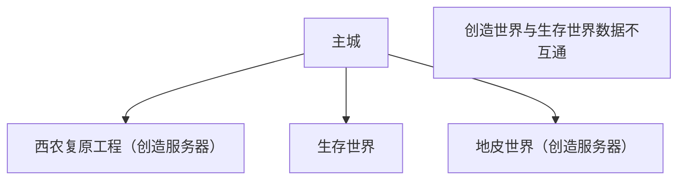
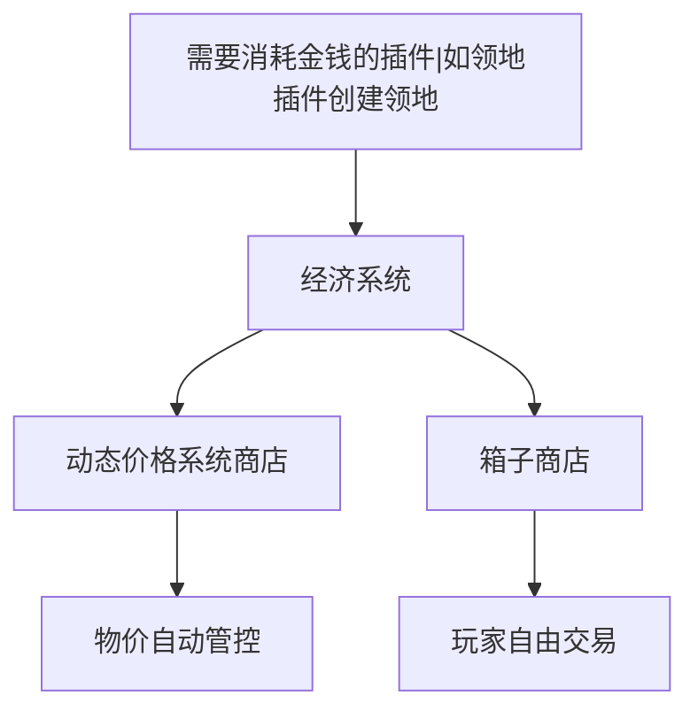
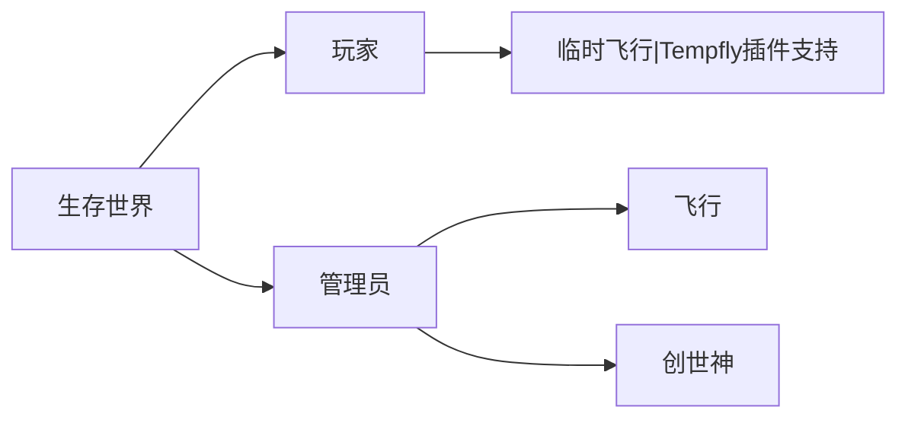
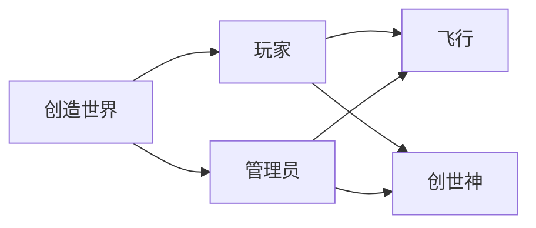

# 新服务器规划

## 问题解答

1. 能否直接移除经济系统？
   - 不能，一些插件（例如领地插件等）需要经济系统保证功能正常。
2. 是否考虑加入小游戏？
   - 目前没有此计划，日活人数低，不适合小游戏模式。
3. 如何控制经济系统导致的物品泛滥。
   - 我们尽可能的规避物品泛滥的情况。服务器预采用系统商店+玩家商店的模式。系统商店会根据供求关系自动调整价格。系统只上架部分物品，会以基建材料为主。

## 服务器世界结构

## 服务器经济结构

## 服务器特殊权限

## 额外玩法

- AureliumSkills
- 粘液科技 [暂不实装]
- 农作物系统

## 服务器插件

| 插件名称             | 简介                                                             |
| -------------------- | ---------------------------------------------------------------- |
| ViaBackwards         | 可以让旧版本可以连接服务器                                       |
| ViaVersion           | 可以连接新版本服务器                                             |
| CoreProtect          | 快速、高效的数据记录和反恶意攻击工具。回滚并恢复任何数量的损坏。 |
| EssentialsXChat      | 基础插件                                                         |
| EssentialsXSpawn     | 基础插件                                                         |
| EssentialsX          | 基础插件                                                         |
| minimotd             | 服务器 MOTD                                                      |
| FastAsyncVoxelSniper | 异步的远程地图编辑工具                                           |
| FastAsyncWorldEdit   | 异步的创世神插件                                                 |
| CommandPanels        | GUI 菜单                                                         |
| WorldEditSUI         | 创世神可视化                                                     |
| GSit                 | 椅子可以坐                                                       |
| multiverse core      | 多世界                                                           |
| ClientDetector       | 客户端检测，查端插件                                             |
| BetterMessages       | 自定义服务器消息                                                 |
| DynamicShop          | 动态商店，价格会根据供需关系动态调整                             |
| LockettePro          | 木牌锁                                                           |
| LuckPerms            | 权限管理器                                                       |
| AntiPopup            | 禁止聊天举报和弹出窗口                                           |
| spark                | 服务器性能分析                                                   |
| plugman              | 服务器插件管理                                                   |
| ProtocolLib          | 类库                                                             |
| PlaceholderAPI       | 占位符                                                           |
| TAB                  | TAB 栏和计分板样式                                               |
| Vault                | 经济基础插件                                                     |
| Residence            | 领地插件                                                         |
| LiteSignIn           | 简易签到插件                                                     |
| ResourceWorld        | 资源世界                                                         |
| plotsquared          | 地皮世界                                                         |
| BetterRTP            | 更好的随机传送                                                   |
