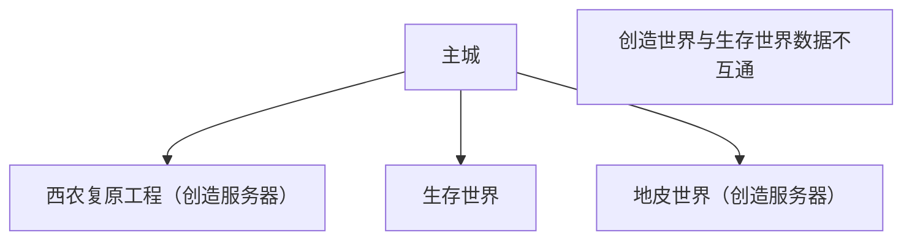
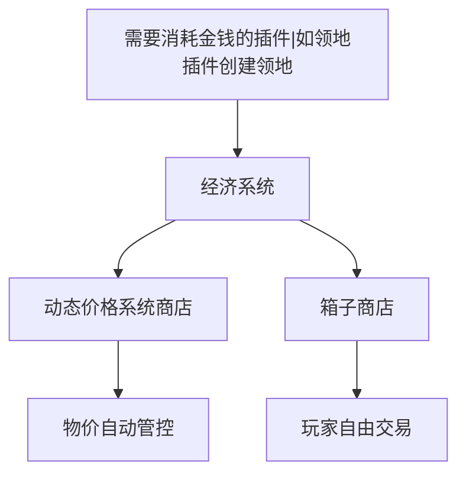
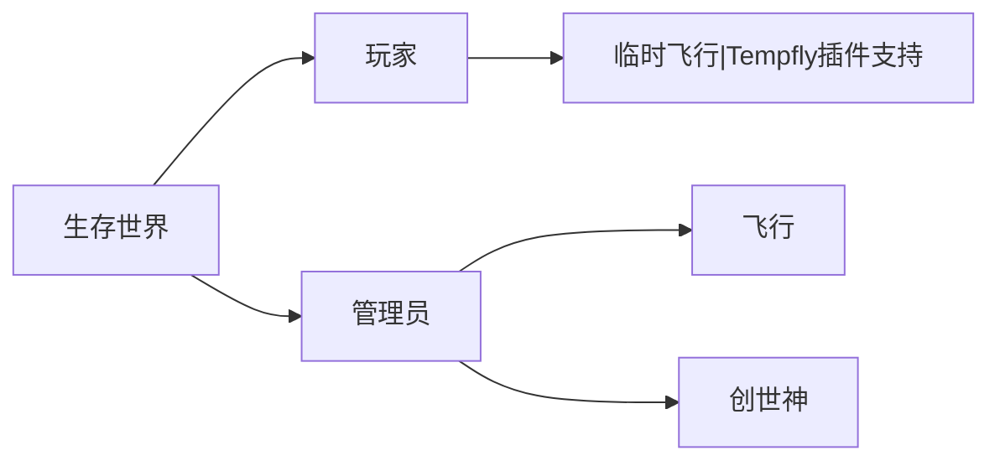
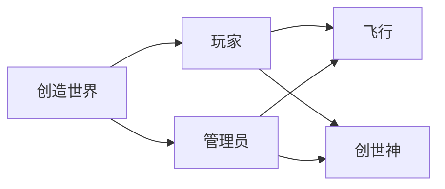

# 新服务器规划

## 问题解答

1. 能否直接移除经济系统？
   - 不能，一些插件（例如领地插件等）需要经济系统保证功能正常。
2. 是否考虑加入小游戏？
   - 目前没有此计划，日活人数低，不适合小游戏模式。
3. 如何控制经济系统导致的物品泛滥。
   - 我们尽可能的规避物品泛滥的情况。服务器预采用系统商店+玩家商店的模式。系统商店会根据供求关系自动调整价格。系统只上架部分物品，会以基建材料为主。

## 服务器世界结构

## 服务器经济结构

## 服务器特殊权限

## 额外玩法

- AureliumSkills [已实装]
- 粘液科技 [暂不实装]
- 农作物系统 [已实装]
