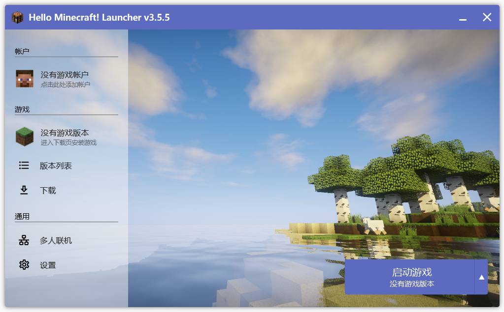
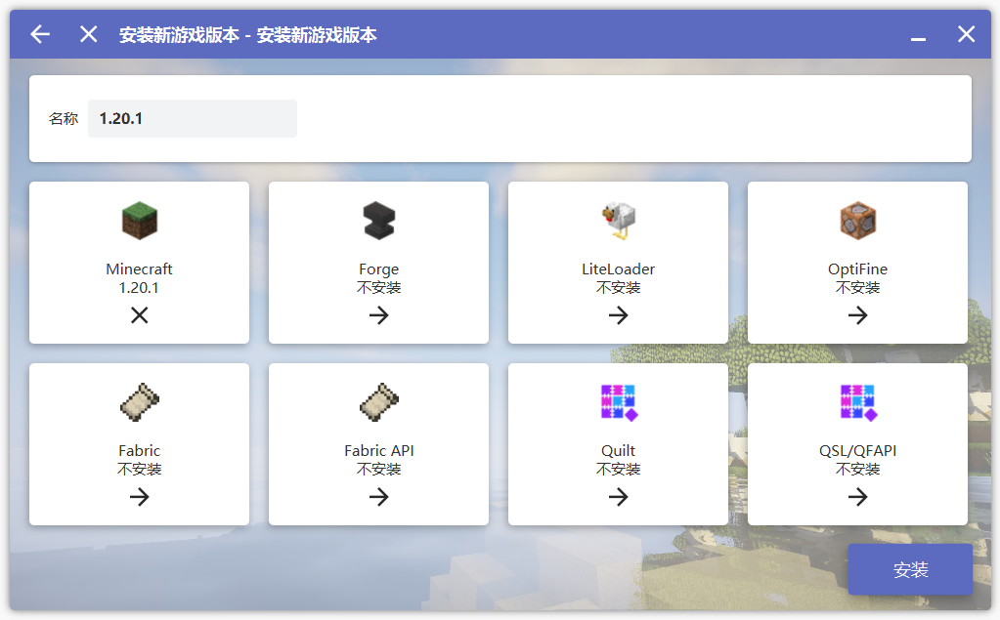

# 我的世界 Java 版下载教程

::: warning
如果你希望游玩模组/整合包，可以自己先尝试探索。后续我们会完善相关内容。
:::

> Minecraft：Java 版（Minecraft: Java Edition）是 Minecraft 的最初版本，由 Mojang Studios 为 Windows、macOS 与 Linux 开发。Notch 于 2009 年 5 月 10 日开始游戏的开发，于 2009 年 5 月 17 日公开发布首个版本。完整的正式版游戏于 2011 年 11 月 18 日的 MINECON 2011 上发布。

## 正版？盗版？

首先声明一下笔者对于正版与盗版的理解：

所谓正版，是指购买了正版的 Minecraft 账号游玩游戏。

所谓盗版，是指在不拥有正版账号情况下，使用提供“无需先登入正版账号即可离线游玩”功能的启动器启动游戏。

笔者认为，只要你拥有我的世界正版账号，无论你是通过第三方登录系统游玩，还是离线游玩，都不属于盗版玩家。

## Java 环境下载

我的世界 Java 版需要 Java 环境来运行，你并不需要知道 Java 是什么，只需要知道下面几点：

- 我的世界 Java 版必须依赖 Java 运行。
- 不同的我的世界版本对 Java 版本的需求不尽相同。

  - | Minecraft 版本                  | 最低要求的 Java 版本 |
    | ------------------------------- | -------------------- |
    | 1.12（17w13a）以前              | Java 7               |
    | 1.12（17w13a）到 1.16（20w22a） | Java 8               |
    | 1.17（21w19a）到 1.17（21w39a） | Java 16              |
    | 1.18（1.18-pre2）及以后         | Java 17              |

- 现在电脑基本都是 64 位系统，如果你是 64 位系统就安装 64 位的 Java。

### 下载链接

| Java 版本  | 下载链接                                                                                 | 来源             |
| ---------- | ---------------------------------------------------------------------------------------- | ---------------- |
| 17         | [点击跳转](https://www.oracle.com/java/technologies/javase/jdk17-archive-downloads.html) | Oracle 官方      |
| 11         | [点击跳转](https://www.oracle.com/java/technologies/javase/jdk11-archive-downloads.html) | Oracle 官方      |
| 17,11      | [点击跳转](https://learn.microsoft.com/zh-cn/java/openjdk/download)                      | 微软             |
| 17,16,11,8 | [点击跳转](https://adoptium.net/zh-CN/temurin/releases)                                  | Eclipse Temurin™ |
| 8          | [点击跳转](https://www.java.com/en/download/)                                            | Oracle 官方      |

## 启动器

作为玩家，我们只需要知道使用启动器来启动《我的世界》（Minecraft）。启动器作为一个入口，为我们提供了方便的方式来启动游戏。

> 从较为专业的角度来看，Minecraft 之所以需要启动器，主要是因为它是用 Java 编写的。Java 程序的运行需要 Java 虚拟机（JVM），而为了让 Java 程序正确运行，JVM 需要传入特定的参数。启动器的作用就是将这些参数封装成一个可视化界面，使玩家能够方便地进行设置和启动游戏。通过使用启动器，玩家无需手动设置和运行 Java 命令，而是通过简单的界面操作来完成启动过程。启动器会自动处理 Java 运行所需的参数，并确保游戏能够正确地启动。这样，玩家可以专注于游戏本身，而无需过多关注底层的 Java 运行细节。

### 启动器的选择

启动器大体可以分为两种：官方启动器和第三方启动器。

- 官方启动器：需要联网对用户名与密码进行验证，通过验证后可以进行在线/离线游玩。

- 第三方启动器：拥有官方启动器的所有功能（除启动基岩版），在此之上部分启动器提供了“无需登入正版即可游玩”的破解功能，更方便的模组下载功能，更多元丰富的游戏设置参数等等。

**因此，我们虽然鼓励大家购买正版游戏，但更推荐使用第三方启动器启动游戏。**

### 启动器下载

#### Minecraft Launcher（官方启动器）

下载链接：微软商店下载

#### Hello Minecraft! Launcher（HMCL 启动器）

下载链接：[https://hmcl.huangyuhui.net/download](https://hmcl.huangyuhui.net/download)

Github: [https://github.com/huanghongxun/HMCL](https://github.com/huanghongxun/HMCL)

#### PCL2 启动器

::: tip
免费版与捐赠版无功能区别
:::

下载链接（免费版）：[https://afdian.net/p/0164034c016c11ebafcb52540025c377](https://afdian.net/p/0164034c016c11ebafcb52540025c377)

捐赠版获取：[https://afdian.net/a/LTCat](https://afdian.net/a/LTCat)

#### BakaXL

下载链接：[https://www.bakaxl.com/](https://www.bakaxl.com/)

#### 其他启动器

[MultiMC](https://multimc.org/) | [Prism Launcher](https://prismlauncher.org/)

## 游戏下载

::: tip
这里以 HMCL 启动器为例，其他启动器同理。
:::

下载好 HMCL 启动器后，新建一个文件夹用于存放游戏，并将启动器放入该文件夹。

```
\---我的世界
        HMCL-3.5.5.exe
```

双击打开启动器，看到如下界面，默认并没有游戏账号和游戏版本：


### 创建/登录账号

你可以先点击账户，登录你的微软账号（正版登录），也可以选择新建一个离线账号。

你也可以添加一个[外置登录](https://blessing.netlify.app/yggdrasil-api/authlib-injector.html)，登录第三方账号，比如[䙶大皮肤站](https://skin.nwafu.com.cn/)。

### 下载游戏本体

点击 下载 选项卡，你可以看到很多的游戏版本（此时忽略侧边栏的`整合包`,`模组`,`资源部`,`世界`等选项）。

::: tip
如果你不知道你想玩什么版本，下载最新版本即可。
:::

选择你想下载的版本，点击该版本。在弹出的界面中有很多选项（Fabric，Forge 等）可以选择。其中 Optifine（高清修复）可以优化帧率，并且添加了着色器（光影）支持。其余选项都是模组加载器或者模组加载器的 Api。

我们这里安装原版 MC，这些可以不用勾选，直接点击安装。

### 我的世界！启动！

安装完成后，回到启动器主页，点击启动游戏即可。

## 补充

### 版本隔离

如果你有多个游戏版本，建议在设置，版本隔离中，勾选“各版本独立”。
